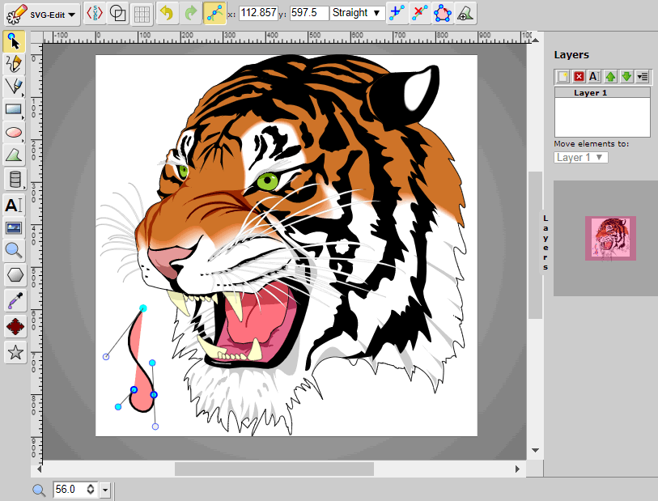

#  SVG-editor

(veja também licenças para dev. deps. )

(Nota: a licença de proteção CC-BY-SA-2.0deve-se ao fato de termos ao menos uma imagem sob esta licença mais rigorosa; para evitar suas condições, gostaríamos de receber uma imagem de substituição. Consulte o item 377 )

[](https://issuehunt.io/r/SVG-Edit/svgedit)

SVG-edit is a fast, web-based, JavaScript-driven SVG drawing editor that
works in any modern browser.


[SVG](https://upload.wikimedia.org/wikipedia/commons/f/fd/Ghostscript_Tiger.svg)

## Procura ajuda

Embora tenhamos feito alguns lançamentos recentes no SVG-edit para correção de erros, refatoração e documentação para tornar a base de código mais sustentável, os principais desenvolvedores responsáveis ​​pela maior parte dos recursos de desenho não estão mais ativos no projeto, por isso gostaríamos de conhecer outros familiares. com o SVG para participar do projeto.

## Demo

### [Experimente a edição SVG aqui](https://svg-edit.github.io/svgedit/editor/svg-editor.html)

```html
<iframe src="svgedit/editor/svg-editor.html?extensions="
    width="100%" height="100%"></iframe>
```

## Navegadores suportados

Os navegadores a seguir foram testados para 2.6 ou anterior e provavelmente continuarão funcionando com o 3.0.

- Firefox 1.5+
- Opera 9.50+
- Safari 4+
- Chrome 1+
- IE 9+ and Edge
